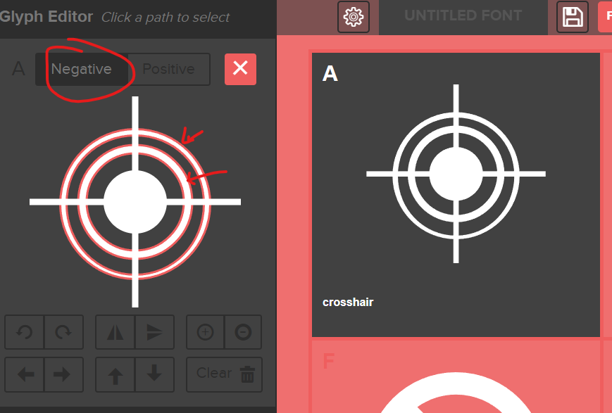
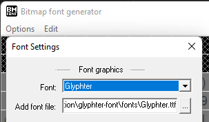

I used https://glyphter.com/ to convert svgs into a font (picked some better arrow that they had)
My crosshair svg needed to be converted to paths, strokes do not work. 
Then when you upload it you need to click the outer rings in the edit bbox a few times to make it a negative, and then there is no gaps

Click here

use garmins recommended tool for font generation
https://developer.garmin.com/connect-iq/core-topics/resources/
https://www.angelcode.com/products/bmfont/
https://developer.garmin.com/connect-iq/connect-iq-faq/how-do-i-use-custom-fonts/

import the font under options -> font options
